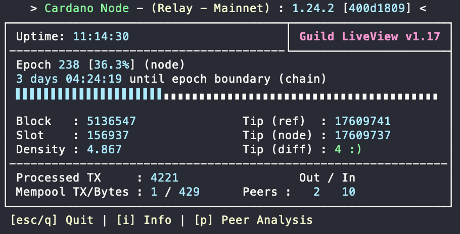

# Nessus Cardano

With Nessus Cardano we explore, praise, comment, contribute to various technical aspects of [Cardano](https://cardano.org).
This is our contribution to "Making The World Work Better For All".

Initially, we focus on a "container first" approach for the Cardano node.

## Running a Relay Node

To get up and running with [Cardano](https://cardano.org), you can spin up a node like this ...

```
docker run --detach \
    --name=relay \
    -p 3001:3001 \
    -v node-data:/opt/cardano/data \
    nessusio/cardano-node run

docker logs -f relay
```

This works on [x86_64](https://hub.docker.com/r/nessusio/cardano-node/tags?name=amd64) and [arm64](https://hub.docker.com/r/nessusio/cardano-node/tags?name=arm64).

The [nessusio/cardano-node](https://hub.docker.com/r/nessusio/cardano-node) image is built from source in a multiple stages like [this](node/docker/Dockerfile).

## Accessing the build-in gLiveView

The image has [gLiveView](https://github.com/cardano-community/guild-operators/blob/alpha/scripts/cnode-helper-scripts/gLiveView.sh) monitoring built in.

For a running container, you can do ...

```
docker exec -it relay gLiveView
```



## Accessing the build-in topology updater

There is currently no P2P module activated in cardano-1.25.1. Your node may call out to well known relay nodes, but you may never have incoming connections.
According to [this](https://github.com/cardano-community/guild-operators/blob/alpha/docs/Scripts/topologyupdater.md) it is necessary to update your topology
every hour. At the time of writing, cardano-node doesn't do this on its own.

This functionality has been built into nessus/cardano-node as well. On startup, you should see a log similar to this ...

```
docker run --detach \
    --name=relay \
    -p 3001:3001 \
    -e CARDANO_UPDATE_TOPOLOGY=true \
    -v node-data:/opt/cardano/data \
    nessusio/cardano-node run

$ docker exec -it relay tail /opt/cardano/logs/topologyUpdateResult
{ "resultcode": "201", "datetime":"2021-01-10 18:30:06", "clientIp": "209.250.233.200", "iptype": 4, "msg": "nice to meet you" }
{ "resultcode": "203", "datetime":"2021-01-10 19:30:03", "clientIp": "209.250.233.200", "iptype": 4, "msg": "welcome to the topology" }
{ "resultcode": "204", "datetime":"2021-01-10 20:30:04", "clientIp": "209.250.233.200", "iptype": 4, "msg": "glad you're staying with us" }
```

The topologyUpdater is triggered by `CARDANO_UPDATE_TOPOLOGY`. Without it, the cron job is not installed.

## External storage for block data

In this configuration, we map the node's `--database-path` to a mounted directory.

```
docker run --detach \
    --name=relay \
    -p 3001:3001 \
    -v /mnt/disks/data00:/opt/cardano/data \
    nessusio/cardano-node run

docker logs -f relay
```

## Using custom configurations

Here we define a config volume called `cardano-relay-config`. It holds the `mainnet-topology.json` file that we setup externally.
Note, that our custom config lives in `/var/cardano/config` and not in the default location `/opt/cardano/config`.

```
docker run --detach \
    --name=relay \
    -p 3001:3001 \
    -e CARDANO_UPDATE_TOPOLOGY=true \
    -e CARDANO_CUSTOM_PEERS="$PRODUCER_IP:3001" \
    -e CARDANO_TOPOLOGY="/var/cardano/config/mainnet-topology.json" \
    -v cardano-relay-config:/var/cardano/config  \
    -v /mnt/disks/data00:/opt/cardano/data \
    nessusio/cardano-node run

docker logs -f relay
```

## Running a Block Producer Node

A producer node is configured in the same way as a Relay node, except that it has some additional key/cert files configured and does not need to update its topology.

```
docker run --detach \
    --name=prod \
    -p 3001:3001 \
    -e CARDANO_BLOCK_PRODUCER=true \
    -e CARDANO_TOPOLOGY="/var/cardano/config/mainnet-topology.json" \
    -e CARDANO_SHELLEY_KES_KEY="/var/cardano/config/keys/pool/kes.skey" \
    -e CARDANO_SHELLEY_VRF_KEY="/var/cardano/config/keys/pool/vrf.skey" \
    -e CARDANO_SHELLEY_OPERATIONAL_CERTIFICATE="/var/cardano/config/keys/pool/node.cert" \
    -v cardano-prod-config:/var/cardano/config  \
    -v /mnt/disks/data01:/opt/cardano/data \
    nessusio/cardano-node run

docker logs -f prod

docker exec -it prod gLiveView
```

## Running the Cardano CLI

We can also use the image to run Cardano CLI commands. For this to work,
the node must share its IPC socket location, which we can then use in the
`cardano-cli` alias definition.

```
alias cardano-cli="docker run -it --rm \
  -v ~/cardano:/var/cardano/local \
  -v relay-ipc:/opt/cardano/ipc \
  nessusio/cardano-node cardano-cli"

cardano-cli query tip --mainnet
{
    "blockNo": 5102089,
    "headerHash": "e5984f27d1d3b5dcc296b33ccd919a28618ff2d77513971bd316cffd35afecda",
    "slotNo": 16910651
}
```

## Kubernetes

This project has started as an incubator space for stuff that may eventually become available upstream. As part of this, we want to
"[provide high quality multiarch docker images and k8s support](https://forum.cardano.org/t/provide-high-quality-multiarch-docker-image-and-k8s-support/47906)"

With Kubernetes as the de-facto standard for container deployment, orchestration, monitoring, scaling , etc, it should be as easy as this to run Cardano nodes …


```
kubectl apply -f nix/docker/k8s/cardano-nodes.yaml

storageclass.storage.k8s.io/cardano-standard-rwo created
persistentvolumeclaim/relay-data created
pod/relay created
service/relay-np created
service/relay-clip created
persistentvolumeclaim/bprod-data created
pod/bprod created
service/bprod-clip created
```

This is documented in detail [over here](https://app.gitbook.com/@tdiesler/s/cardano/k8s/cardano-k8s).

For details you may want to have a look at [nix/docker/k8s/cardano-nodes.yaml](https://github.com/tdiesler/nessus-cardano/blob/master/nix/docker/k8s/cardano-nodes.yaml).


## Docker Compose

We sometimes may prefer somm middle ground between manually spinning up individual docker containers and the full blown enterprise Kubernetes account.

Perhaps we'd like to use [Docker Compose](https://docs.docker.com/compose).

```
$ docker-compose -f nix/compose/docker-compose.yaml up --detach

Creating compose_relay ... done
Creating compose_bprod ... done
```

For details you may want to have a look at [nix/docker/compose/docker-compose.yaml](https://github.com/tdiesler/nessus-cardano/blob/master/nix/docker/compose/docker-compose.yaml).

## Ledger State

For a Stake Pool Operator it is important to know when the node is scheduled to produce the next block. We definitely want to be online at that important moment and fullfil our block producing duties. There are better times to do node maintenance.

This important functionality has also been built into [nessusio/cardano-tools](https://hub.docker.com/r/nessusio/cardano-tools) the image.

First, we also define an alias and ping the node that we want to work with.

Details about this API are [here](https://github.com/AndrewWestberg/cncli/blob/develop/README.md#running).

```
$ alias cncli="docker run -it --rm \
  -v ~/cardano/keys:/var/cardano/keys \
  -v cncli:/var/cardano/cncli \
  nessusio/cardano-tools cncli"

NODE_IP=192.168.0.30

cncli ping --host $NODE_IP
{
  "status": "ok",
  "host": "10.128.0.31",
  "port": 3001,
  "connectDurationMs": 0,
  "durationMs": 53
}
```

### Syncing the database

This command connects to a remote node and synchronizes blocks to a local sqlite database.

```
$ cncli sync --host $NODE_IP \
  --db /var/cardano/cncli/cncli.db \
  --no-service

...
2021-03-04T10:23:19.719Z INFO  cardano_ouroboros_network::protocols::chainsync   > block 5417518 of 5417518, 100.00% synced
2021-03-04T10:23:23.459Z INFO  cncli::nodeclient::sync                           > Exiting...
```

### Slot Leader Schedule

We can now obtain the leader schedule for our pool.

```
$ cncli leaderlog \
  --pool-id 9e8009b249142d80144dfb681984e08d96d51c2085e8bb6d9d1831d2 \
  --shelley-genesis /opt/cardano/config/mainnet-shelley-genesis.json \
  --byron-genesis /opt/cardano/config/mainnet-byron-genesis.json \
  --pool-vrf-skey /var/cardano/keys/pool/vrf.skey \
  --db /var/cardano/cncli/cncli.db \
  --tz Europe/Berlin \
  --ledger-set next | tee leaderlog.json

cat leaderlog.json | jq -c ".assignedSlots[] | {no: .no, slot: .slotInEpoch, at: .at}"

{"no":1,"slot":165351,"at":"2021-02-26T20:40:42+01:00"}
{"no":2,"slot":312656,"at":"2021-02-28T13:35:47+01:00"}
{"no":3,"slot":330588,"at":"2021-02-28T18:34:39+01:00"}
{"no":4,"slot":401912,"at":"2021-03-01T14:23:23+01:00"}
```

Enjoy!
